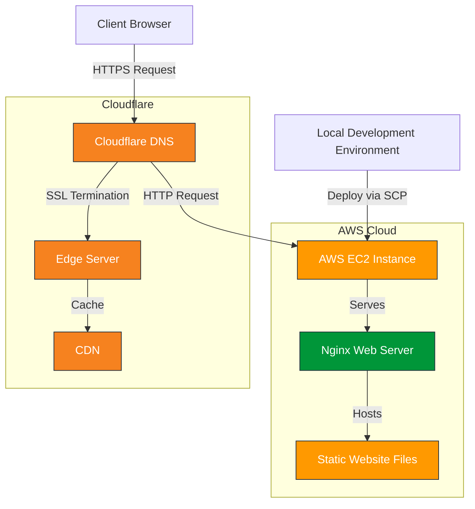
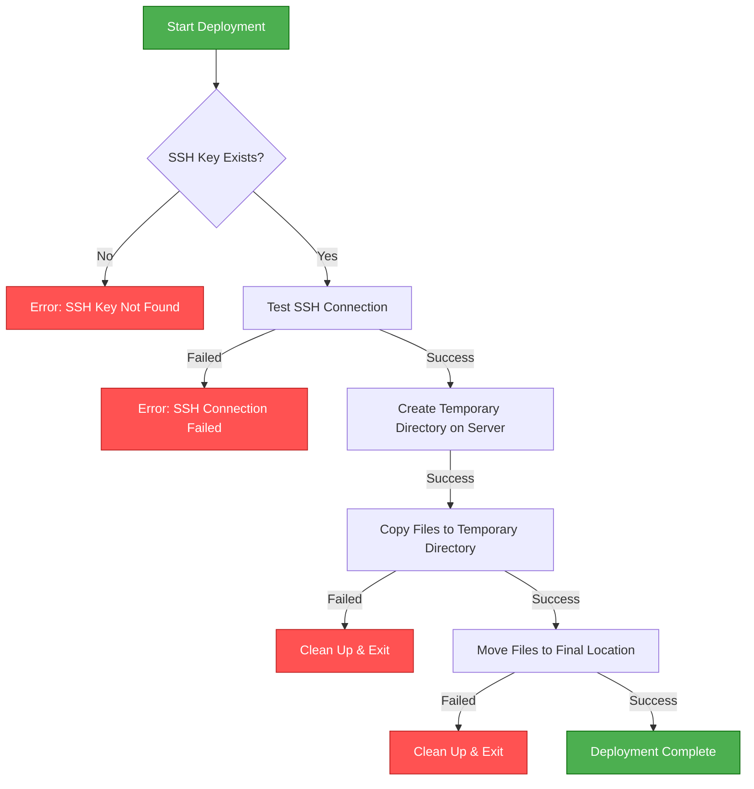
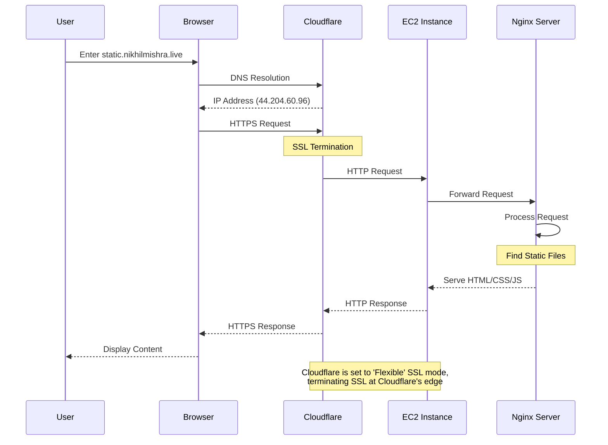

# Static Site Server Project

This project is designed to help you learn the basics of setting up a web server using a static site served by Nginx. You will deploy your static site on an AWS EC2 instance and use Cloudflare for DNS management. The project is part of the roadmap on [roadmap.sh](https://roadmap.sh/projects/static-site-server).

## Project Page

For more details about this project, visit the project page on roadmap.sh:  
[Static Site Server Project](https://roadmap.sh/projects/static-site-server)

## Table of Contents

- [Overview](#overview)
- [Prerequisites](#prerequisites)
- [Architecture](#architecture)
- [Deployment Process](#deployment-process)
- [Request Flow](#request-flow)
- [Setup and Deployment](#setup-and-deployment)
  - [AWS EC2 Setup](#aws-ec2-setup)
  - [Nginx Installation and Configuration](#nginx-installation-and-configuration)
  - [Deploying Your Static Site](#deploying-your-static-site)
- [DNS Configuration with Cloudflare](#dns-configuration-with-cloudflare)
- [Notes on HTTPS](#notes-on-https)
- [Troubleshooting](#troubleshooting)
- [License](#license)

## Overview

In this project, you will:
- Launch an AWS EC2 instance.
- Install and configure Nginx to serve a static site.
- Deploy your static site files using a deployment script (using `scp`).
- Configure your DNS on Cloudflare so that your subdomain (e.g., `static.nikhilmishra.live`) points to your EC2 instance.
- (Optional) Configure HTTPS on your EC2 server. (For now, we are using HTTP on the server with Cloudflare in Full mode.)

## Prerequisites

- **AWS Account:** You need an active AWS account and an EC2 instance (preferably running Amazon Linux or Ubuntu).
- **SSH Access:** Ensure you have SSH access to your EC2 instance with your private key (e.g., `~/.ssh/my_second_key`).
- **Domain and Cloudflare Account:** Your domain (e.g., `nikhilmishra.live`) is managed through Cloudflare, with an A record pointing to your EC2 instance's public IP.
- **Basic Knowledge of Linux and Nginx:** Familiarity with terminal commands, file editing, and basic Nginx configuration.

## Architecture

Below is the architecture diagram for the static site server setup:



## Deployment Process

The following diagram illustrates the deployment process using the `deploy.sh` script:



## Request Flow

This sequence diagram shows how a client request flows through the system:



## Setup and Deployment

### AWS EC2 Setup

1. **Launch an EC2 Instance:**  
   Create and configure an EC2 instance (using Amazon Linux, Ubuntu, or similar). Ensure that your security group allows inbound traffic on port 22 (SSH) and port 80 (HTTP).

2. **SSH Access:**  
   Connect to your instance using:
   ```bash
   ssh -i ~/.ssh/my_second_key ec2-user@<your-ec2-public-ip>
   ```

### Nginx Installation and Configuration

1. **Install Nginx:**
   - **Amazon Linux 2 / Ubuntu:**
     ```bash
     sudo yum install nginx -y    # or sudo apt install nginx -y
     sudo systemctl start nginx
     sudo systemctl enable nginx
     ```

2. **Configure Nginx for Your Static Site:**  
   Create a server block file (e.g., `/etc/nginx/conf.d/static-site.conf`) with the following content:
   ```nginx
   server {
       listen 80;
       server_name static.nikhilmishra.live;

       root /usr/share/nginx/html;
       index index.html index.htm;

       location / {
           try_files $uri $uri/ =404;
       }

       access_log /var/log/nginx/static-site-access.log;
       error_log /var/log/nginx/static-site-error.log;
   }
   ```
3. **Test and Reload Nginx:**
   ```bash
   sudo nginx -t
   sudo systemctl reload nginx
   ```

### Deploying Your Static Site

Use the following `deploy.sh` script (which uses `scp`) to deploy your site from your local machine:

```bash
#!/bin/bash

########
# Author: Your Name
# Date: 2025-02-04
#
# Version: v1.2
#
# Static Site Server Deployment Script
#
# This script uses scp to sync your static site from your local machine to a remote server.
########

# Enable debug mode
set -x

# Change to script directory
cd "$(dirname "$0")" || exit

# Remote server details
REMOTE_USER="ec2-user"
REMOTE_HOST="44.204.60.96"
REMOTE_DIR="/usr/share/nginx/html"

# SSH key path
SSH_KEY="$HOME/.ssh/my_second_key"

# Check if SSH key exists
if [ ! -f "$SSH_KEY" ]; then
    echo "Error: SSH key not found at $SSH_KEY"
    exit 1
fi

# Test SSH connection first
echo "Testing SSH connection..."
if ! ssh -i "$SSH_KEY" -o BatchMode=yes -o ConnectTimeout=5 "$REMOTE_USER@$REMOTE_HOST" echo "SSH connection successful"; then
    echo "Error: SSH connection failed. Please check your SSH key and server configuration."
    exit 1
fi

# Create a temporary directory on the remote server
echo "Creating temporary directory on remote server..."
TEMP_DIR="/tmp/static-site-$(date +%s)"
if ! ssh -i "$SSH_KEY" "$REMOTE_USER@$REMOTE_HOST" "mkdir -p $TEMP_DIR"; then
    echo "Error: Failed to create temporary directory"
    exit 1
fi

# Copy files to temporary directory
echo "Copying files to remote server..."
if ! scp -i "$SSH_KEY" -r ./* "$REMOTE_USER@$REMOTE_HOST:$TEMP_DIR/"; then
    echo "Error: Failed to copy files"
    ssh -i "$SSH_KEY" "$REMOTE_USER@$REMOTE_HOST" "rm -rf $TEMP_DIR"
    exit 1
fi

# Move files to final location
echo "Moving files to final location..."
if ! ssh -i "$SSH_KEY" "$REMOTE_USER@$REMOTE_HOST" "sudo rm -rf $REMOTE_DIR/* && sudo cp -r $TEMP_DIR/* $REMOTE_DIR/ && sudo chown -R nginx:nginx $REMOTE_DIR && sudo chmod -R 755 $REMOTE_DIR && rm -rf $TEMP_DIR"; then
    echo "Error: Failed to move files to final location"
    ssh -i "$SSH_KEY" "$REMOTE_USER@$REMOTE_HOST" "rm -rf $TEMP_DIR"
    exit 1
fi

echo "Deployment completed successfully!"
```

1. Save the file as `deploy.sh` in your project folder.
2. Make it executable:
   ```bash
   chmod +x deploy.sh
   ```
3. Run it from Git Bash or WSL:
   ```bash
   ./deploy.sh
   ```

## DNS Configuration with Cloudflare

1. **Log in to Cloudflare:**  
   Go to your Cloudflare dashboard and select your domain (e.g., `nikhilmishra.live`).

2. **Create an A Record:**  
   Create an A record for your subdomain:
   - **Name:** static  
   - **IPv4 Address:** 44.204.60.96  
   - **Proxy status:** Enable Cloudflare proxy (orange cloud) if you wish to use Cloudflare’s SSL and caching features.

3. **SSL Settings:**  
   If you are not handling HTTPS on your EC2 server, you can set Cloudflare’s SSL mode to **Flexible**. This will encrypt traffic between the visitor and Cloudflare while connecting to your server via HTTP. Alternatively, if you later configure HTTPS on your server, you can switch to **Full** or **Full (strict)**.

## Notes on HTTPS

- **Current Setup:**  
  At this time, the EC2 server is serving only HTTP. Cloudflare is set to handle SSL on the edge.
  
- **Future Improvements:**  
  You may choose to set up HTTPS on your EC2 server using a self-signed certificate or a free Let's Encrypt certificate for end-to-end encryption. For now, Cloudflare's Flexible SSL mode will secure the connection between the client and Cloudflare.

## Troubleshooting

- **Nginx Issues:**  
  If your site does not display correctly, check the Nginx error logs:
  ```bash
  sudo tail -f /var/log/nginx/error.log
  ```
- **DNS Propagation:**  
  DNS changes can take a few minutes to propagate. Use tools like [DNS Checker](https://dnschecker.org) to confirm that your subdomain resolves to your server’s IP.
- **Deployment Problems:**  
  Ensure that your SSH key and remote credentials are correct. You can manually test SSH connectivity:
  ```bash
  ssh -i ~/.ssh/my_second_key ec2-user@44.204.60.96
  ```

## License

This project is provided for educational purposes. Modify and distribute as needed.

---

With these instructions and the provided script, you should be able to deploy your static site server and serve your content at [static.nikhilmishra.live](https://static.nikhilmishra.live) via Cloudflare. Happy coding and learning!
