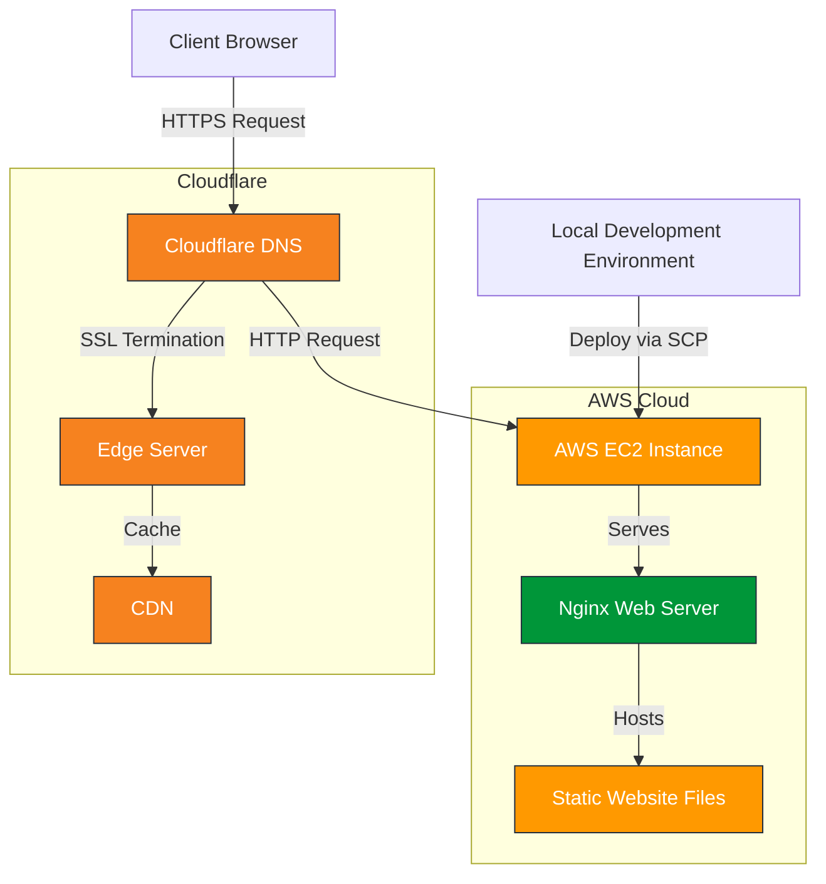
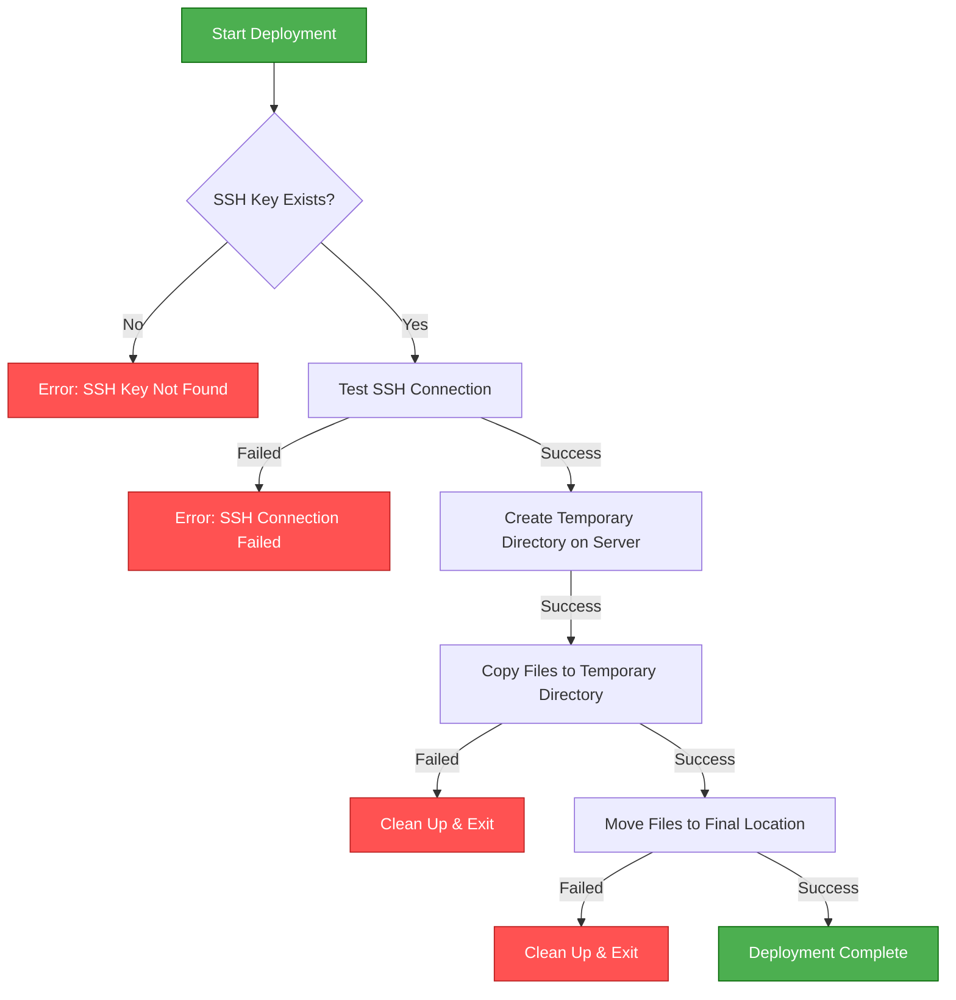
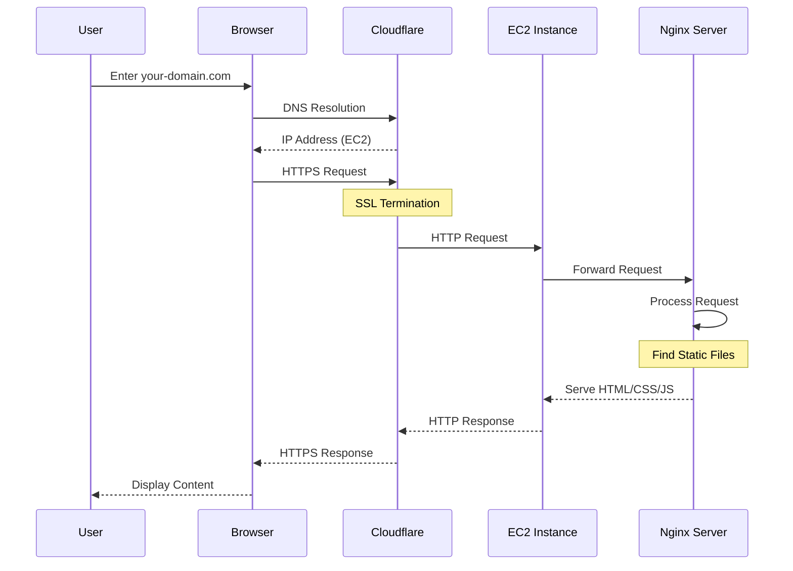

# Building a Production-Ready Static Website with AWS EC2, Nginx, and Cloudflare

## Introduction

In today's digital landscape, deploying static websites efficiently, securely, and cost-effectively is a fundamental skill for developers. In this technical deep dive, I'll walk you through creating a production-grade static website hosting solution using AWS EC2, Nginx, Cloudflare, and Let's Encrypt. This project showcases a robust deployment pipeline that ensures reliability, security, and performance.


## Project Overview

We're building a complete static site hosting solution with these core components:

- **AWS EC2 Instance** (Amazon Linux 2023) - Our cloud server
- **Nginx** - Our high-performance web server
- **Let's Encrypt** - For free, automated SSL/TLS certificates
- **Cloudflare** - For DNS management, CDN, and additional security layers
- **Custom Bash Deployment Script** - For automated, secure deployments

## Technical Architecture

Let's begin by understanding the system architecture:



This diagram illustrates how client requests flow through our infrastructure:

1. The client's browser sends an HTTPS request to our domain
2. Cloudflare handles DNS resolution and SSL termination at its edge servers
3. The request is forwarded to our AWS EC2 instance
4. Nginx processes the request and serves the static files
5. The response flows back through the same path to the client

The architecture leverages Cloudflare's global CDN for improved performance and DDoS protection, while keeping our server setup lean and focused.

## Automated Deployment Pipeline

For consistent and reliable deployments, we've created a robust bash script that uses SCP to securely transfer files from your local environment to the server:



Here's the deployment script:

```bash
#!/bin/bash

########
# Author: Your Name
# Date: 2025-02-28
#
# Version: v1.2
#
# Static Site Server Deployment Script
#
# This script uses scp to sync your static site from your local machine to a remote server.
########

# Enable debug mode
set -x

# Change to script directory
cd "$(dirname "$0")" || exit

# Remote server details
REMOTE_USER="ec2-user"
REMOTE_HOST="your-ec2-ip-address"
REMOTE_DIR="/usr/share/nginx/html"

# SSH key path
SSH_KEY="$HOME/.ssh/your_key.pem"

# Check if SSH key exists
if [ ! -f "$SSH_KEY" ]; then
    echo "Error: SSH key not found at $SSH_KEY"
    exit 1
fi

# Test SSH connection first
echo "Testing SSH connection..."
if ! ssh -i "$SSH_KEY" -o BatchMode=yes -o ConnectTimeout=5 "$REMOTE_USER@$REMOTE_HOST" echo "SSH connection successful"; then
    echo "Error: SSH connection failed. Please check your SSH key and server configuration."
    exit 1
fi

# Create a temporary directory on the remote server
echo "Creating temporary directory on remote server..."
TEMP_DIR="/tmp/static-site-$(date +%s)"
if ! ssh -i "$SSH_KEY" "$REMOTE_USER@$REMOTE_HOST" "mkdir -p $TEMP_DIR"; then
    echo "Error: Failed to create temporary directory"
    exit 1
fi

# Copy files to temporary directory
echo "Copying files to remote server..."
if ! scp -i "$SSH_KEY" -r ./* "$REMOTE_USER@$REMOTE_HOST:$TEMP_DIR/"; then
    echo "Error: Failed to copy files"
    ssh -i "$SSH_KEY" "$REMOTE_USER@$REMOTE_HOST" "rm -rf $TEMP_DIR"
    exit 1
fi

# Move files to final location
echo "Moving files to final location..."
if ! ssh -i "$SSH_KEY" "$REMOTE_USER@$REMOTE_HOST" "sudo rm -rf $REMOTE_DIR/* && sudo cp -r $TEMP_DIR/* $REMOTE_DIR/ && sudo chown -R nginx:nginx $REMOTE_DIR && sudo chmod -R 755 $REMOTE_DIR && rm -rf $TEMP_DIR"; then
    echo "Error: Failed to move files to final location"
    ssh -i "$SSH_KEY" "$REMOTE_USER@$REMOTE_HOST" "rm -rf $TEMP_DIR"
    exit 1
fi

echo "Deployment completed successfully!"
```

This script includes several best practices:
- SSH connection validation before attempting deployment
- Temporary directory usage for atomic deployments
- Proper error handling with cleanup on failure
- Appropriate file permissions for security

## Cloudflare Integration: DNS and Security

Cloudflare provides an additional layer of protection and performance optimization:



To set up Cloudflare:

1. Add your domain to Cloudflare and update nameservers
2. Create an A record pointing to your EC2 instance's IP address
3. Configure SSL/TLS settings:
   - For maximum security: Full (strict) mode (requires valid SSL cert on server)
   - For simpler setup: Full mode (works with self-signed certs)
4. Enable additional security features:
   - Always Use HTTPS
   - HSTS (HTTP Strict Transport Security)
   - Browser Integrity Check

## Performance Optimization

To ensure optimal performance, we implemented several optimizations:

1. **Nginx Configuration Tuning**:
   - Gzip compression for reduced bandwidth usage
   - Optimized worker processes based on CPU cores
   - File cache settings for frequently accessed content

2. **Cloudflare Performance Settings**:
   - Auto Minify for HTML, CSS, and JavaScript
   - Brotli compression (more efficient than gzip)
   - Rocket Loader for asynchronous JavaScript loading

3. **Static Asset Optimization**:
   - WebP image format for better compression
   - Defer loading of non-critical resources
   - Cache control headers for optimal browser caching

## Monitoring and Maintenance

For ongoing maintenance, we set up:

1. **Log Rotation**:
```bash
sudo logrotate -d /etc/logrotate.d/nginx
```

2. **Simple Health Check Script**:
```bash
#!/bin/bash
# health_check.sh
HTTP_STATUS=$(curl -s -o /dev/null -w "%{http_code}" https://your-domain.com)
if [ "$HTTP_STATUS" -ne 200 ]; then
  echo "Site is down! HTTP Status: $HTTP_STATUS"
  # Add notification logic here (email, SMS, etc.)
fi
```

3. **Basic Performance Monitoring**:
```bash
# Monitor Nginx process and resource usage
sudo watch -n 5 "ps aux | grep nginx"
```

## Challenges and Solutions

### Challenge 1: Atomic Deployments

**Problem**: How to update the site without downtime or showing partial updates?

**Solution**: Our deployment script uses a temporary directory approach, only replacing the files after a complete copy is successful. This ensures users never see a partially updated site.

### Challenge 2: SSL Certificate Management

**Problem**: Manual SSL certificate renewal is error-prone and can lead to outages.

**Solution**: Automated certificate renewal through certbot's cron job:
```bash
echo "0 3 * * * root certbot renew --quiet" | sudo tee -a /etc/crontab
```

### Challenge 3: Security Hardening

**Problem**: Default configurations are often not secure enough for production.

**Solution**: Implemented multiple security layers:
- Strong Nginx security headers
- Cloudflare WAF (Web Application Firewall)
- Regular security patches via automatic updates
- Limited SSH access to specific IP addresses

## Future Enhancements

Looking ahead, several enhancements could further improve this setup:

1. **CI/CD Pipeline Integration**: Connecting with GitHub Actions or similar CI/CD tools for automated testing and deployment.

2. **Infrastructure as Code**: Converting the manual setup to Terraform or CloudFormation templates.

3. **Advanced Monitoring**: Implementing more comprehensive monitoring with tools like Prometheus and Grafana.

4. **Content Versioning**: Implementing a blue-green deployment strategy for zero-downtime updates with rollback capability.

## Conclusion

This project demonstrates how to build a robust, secure, and performant static website hosting infrastructure using AWS EC2, Nginx, Let's Encrypt, and Cloudflare. The architecture provides multiple layers of security, optimized performance, and a streamlined deployment process.

By following these steps, you can create a production-grade hosting environment for static websites that strikes an excellent balance between cost, performance, and security. The modular approach also makes it easy to scale or modify specific components as your needs evolve.

---

*Want to see the full code? Check out the [project repository](https://github.com/yourusername/static-site-server) on GitHub!*

*Published on February 28, 2025*
